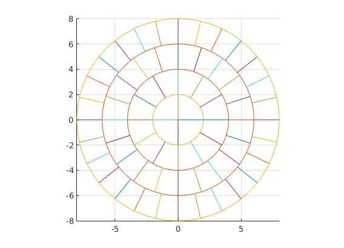

Present: Robert Clegg, Bastiaan Cockx, Stefan Lang

**Bas** is making good progress on agent states
- States as "primary" (simple values) and "secondary" (calculated from primary states)
- No speed loss in this approach (1 million made in 200 ms)!
Next needs to focus on
- Agent-boundary interactions
- Agent-grid interactions (finding the voxel that contains the agent centre is already possible)

**Stefan** has nice-looking diagrams of cylindrical voxels
- Written in MatLab, will port into Java once it's working well

Next challenges are
- Iterating through neighbour voxels of a focal voxel
- Calculating the surface area neighbouring voxels share

**Rob** has ODE and PDE solvers up and running
- So far only Dirichlet and Neumann boundaries
- So far only explicit solver for PDEs, Rosenbrock solver for ODEs
- So far no way of setting the domain/diffusivity to differ over a compartment
- Compartments are able to take a total size and decide a way of dividing it up into a grid
- Test run fine in a "Simulator" object with multiple compartments, although the compartments are not yet joined together

Next challenges are
- Cyclic boundaries for solutes
- Implementing more complex PDE solvers
- Implementing domain/diffusivity methods (e.g. diffusivity reduced inside biofilm)
