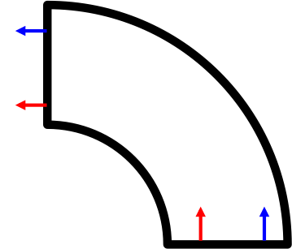

Present: Robert Clegg, Bastiaan Cockx, Stefan Lang

**Stefan** has rearranged class hierarchies of SpatialGrids as we discussed last time. He has location-coordinate mapping sorted but is still working on the neighbour iterator. He's also getting used to GitHub and will put in a pull request soon.

We discussed cyclic boundaries in sections of circular/cylindrical/spherical compartments

Stefan thinks that limiting the size of sections to multiples of 90 degrees would be best, which is absolutely fine with Bas and Rob.

We also discussed how best to distribute cell mass over grid voxels for the purpose of performing reactions (especially important when modelling filaments that span multiple voxels). Bas would like to get the centres of voxels to put into his collision class - but if the resolution is too coarse then he would need voxels to be divided up into subvoxels for this purpose. In polar grids, most of the voxels are almost cuboid so a regular subdivision should be good enough.

**Rob** is still waiting for a book to arrive before he gets the PDE stuff going properly, so has been working on tidying the linear algebra package instead.

Use the word "clade" instead of "species"? It avoids confusion with the chemical use of "species". Rob also suggested "breed" as used in NetLogo.
