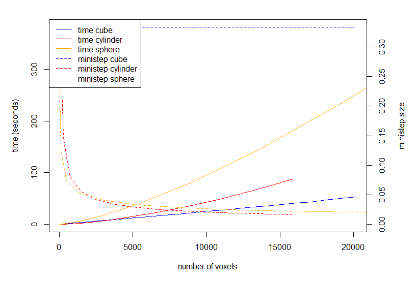

Present: Bastiaan Cockx, Stefan Lang

# non-cartesian shapes

- Stefan has been investigating the maximum mini time step for the pde solver for different compartment shapes. non-cartesian shapes require much finer pde mini timesteps, resulting in far longer evaluation times (see figure).

- Agents in non-cartesian shapes are still not behaving properly, Bas will look into this after Stefan's pull request has been merged.

- The shape iterator can not be used on multiple threads simultaniously (not thread safe). Therefor the iterator cannot be used to render the shape or solute grids in the openGL render window. Two solutions are proposed:
(1) We could use an third-party library to generate the quad-strips for the compartment shape. This however would still not allow us to render solute grids. 
(2) We could have iterator as a seperate object, new iterators can be requested by the gl renderer to have multiple threads iterate over the grid simultaniously.

- Bas will share the pov-ray header file used for the MEWE renders, the render settings can be used as an iDynoMiCS 2 render style for "nice" presentations and posters.

# profiling

- Bas has investigated the iDynoMiCS memory usage. Memory usage seems to be correlated more with time than with domain size or agent count and iDynoMiCS 2 memory usage tends to run into gigabyte range very fast. This could indicate a lot of objects are created only for single time usage. Most used object classes are int[] and char[] outranking other classes with an order of magnitude or more.

| object | size (bytes) | count |
|---|---|---|
| int[] | 5612544 | 39064 | 
| char[] | 2394480 | 25507 | 
| java.awt.Rectangle | 679584 | 21237 | 
| java.lang.Object[] | 632432 | 14387 | 
| java.lang.String | 591984 | 24666 | 
