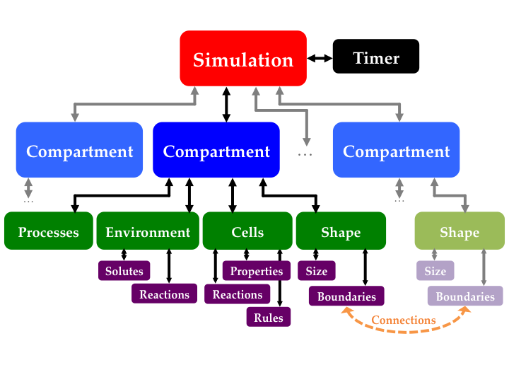

# iDynoMiCS 2

## Compartments
In iDynoMiCS 2, the building blocks of a simulation are compartments. Any simulation must have at least one of these, and if it has multiple compartments then these should be somehow connected to one another. Examples of compartments include, but are not limited to:
- a chemostat, also known as a CSTR (i.e. a well-mixed container, where fluid is added and removed at the same rate to ensure fixed volume; a chemostat without any fluid flow is known as a batch culture)
- an aqueous biofilm (i.e. a spatially-structured region, where solute transport is diffusion-limited and cells aggregate)
- a gut mucosal layer (similar to an aqueous biofilm, but where structural support is given by host epithelial cells; these may produce mucous and other substances)
- a Petri dish (another spatially-structured region, but where nutrients are provided by a layer of Agar below the biofilm and there is air above).

Each compartment has four main components:
- a **shape** (this includes physical size, and any boundaries)
- an **environment container** (this holds any dissolved solutes modelled as continuous concentration fields)
- an **agent container** (this holds any agents - be they live or inert - modelled as discrete particles)
- an ordered list of **process managers**.

**Figure 1. General structure of iDynoMiCS 2.**

Within each simulation time-step, each compartment functions as a self-contained unit. Agents that were queued to enter the compartment in the previous time-step are dealt with first, then the processes are executed without any reference to other compartments. When all compartments have been iterated over, all outgoing agents are pushed to their destined compartments and the simulation moves on to the next time-step.

### Compartment shape
Compartment shapes must be drawn from a list of pre-defined shapes; users are encouraged to define further shapes in Java source code if necessary, but should not attempt to define them in protocol files alone. Different compartment shapes have different requirements regarding boundaries, and will specify different SpatialGrid types depending on what is appropriate (there may be some choice in this; see Table 1). Note that one-dimensional shapes are not typically well suited to agent-based modeling, and are included so that the user may run a population-based model (typically a set of partial differential equations, or PDEs) for comparison.

| Name          | Dimensions | Required (and *optional*) boundary sides                   | SpatialGrid type              |
| ------------- |:----------:| ---------------------------------------------------------- | ----------------------------- |
| Dimensionless | 0          | none                                                       | none                          |
| Line          | 1          | XMIN, XMAX                                                 | CartesianGrid                 |
| Rectangle     | 2          | XMIN, XMAX, YMIN, YMAX                                     | CartesianGrid                 |
| Cuboid        | 3          | XMIN, XMAX, YMIN, YMAX, ZMIN, ZMAX                         | CartesianGrid                 |
| Radius        | 1          | (*RMIN*), RMAX                                             | SphericalGrid/CylindricalGrid |
| Circle        | 2          | (*RMIN*), RMAX, (*THETAMIN, THETAMAX*)                     | SphericalGrid/CylindricalGrid |
| Sphere        | 3          | (*RMIN*), RMAX, (*THETAMIN, THETAMAX*), (*PHIMIN, PHIMAX*) | SphericalGrid                 |
| Cylinder      | 3          | (*RMIN*), RMAX, (*THETAMIN, THETAMAX*), ZMIN, ZMAX         | CylindricalGrid               |

**Table 1. Compartment shapes available.**

Boundaries must contain two types of method: one relating to the agents, and one for each solute. In simpler cases (e.g. zero flux) the method may be identical for each solute, but for generality we keep open the option of setting each solute separately. The agent methods are then passed to the agent container, and the solute methods to the environment container (on the correct boundary side). The logic behind this is that the agents do not need to know what is happening to the solutes at these boundaries, and vice versa.

### Environment container
The environment container is primarily a collection of spatial grids; these, in turn, are primarily a collection of arrays of real numbers representing aspects of a dissolved solute: concentration, diffusivity, etc. The environment container also holds all of the reactions that are not catalysed by agents - from here on, these are referred to as extracellular reactions. The environment inherits the shape of the compartment, including the lengths of each dimension. It is the job of the environment container to decide how this should be best divided in the spatial grids, and there may even be potential to have this vary as the simulation proceeds (i.e. adaptive grids).

Common boundary grid methods include:
- [Dirchlet](https://en.wikipedia.org/wiki/Dirichlet_boundary_condition) boundaries, i.e. those where the concentration of each solute is kept fixed as the diffusion-reaction is solved within a compartment time step. This need not be constant across the length of the boundary, but could instead depend on position along the boundary. One practical usage of the Dirichlet boundary is in boundaries that connect the focal compartment to another compartment: the concentration across this connection is assumed not to change within a compartment time step, and is only updated when all compartments are synced with one another.
- [Neumann](https://en.wikipedia.org/wiki/Neumann_boundary_condition) boundaries, i.e. those where the concentration gradient is kept fixed as the diffusion-reaction is solved within a compartment time step. As for a Dirichlet boundary, this need not be constant along the length of the boundary. One practical usage of the Neumann boundary is in an impermeable boundary, where a solute cannot diffuse through and so the concentration gradient is set to zero.
- Cyclic boundaries (also known as [Periodic](https://en.wikipedia.org/wiki/Periodic_boundary_conditions) boundaries), i.e. those where any solute diffusing across reappears instantly at the equivalent position on the partner boundary.

### Agent container
The agent container manages all the agents in the compartment: it has a list of all agents that do not have a location (or just a list of all agents, if the compartment is a chemostat), and a spatial registry for all located agents. The spatial registry detects collisions between agents (or between an agent and a boundary), and finds the agents within a certain distance of a given point.

### Process managers
Process managers work on the agent container and/or the environment container. Examples include, but are not limited to:
- solving solute transport using a numerical solving algorithm (typically an ODE solver in a dimensionless compartment, and a PDE solver in all other compartment shapes) and querying agents for their impact on their local environment
- stepping through agents in the agent container; these will often need to query their local environment during this process.
- resolving agent-agent overlaps in spatially structured environments.

Each process manager is initialised with its own time-step and time point at which it should next be executed. The compartment it belongs to is responsible for executing processes at the correct time and in the correct order, but a process is itself responsible for managing when it should next be executed. When there is a clash between two (or more) processes due to be executed at the same time, the compartment chooses the one with the higher *priority*, another parameter that may be set by the user.

## Notes

### Relative diffusivity
[This paper](http://journals.plos.org/plosone/article?id=10.1371/journal.pone.0146093) might be useful
